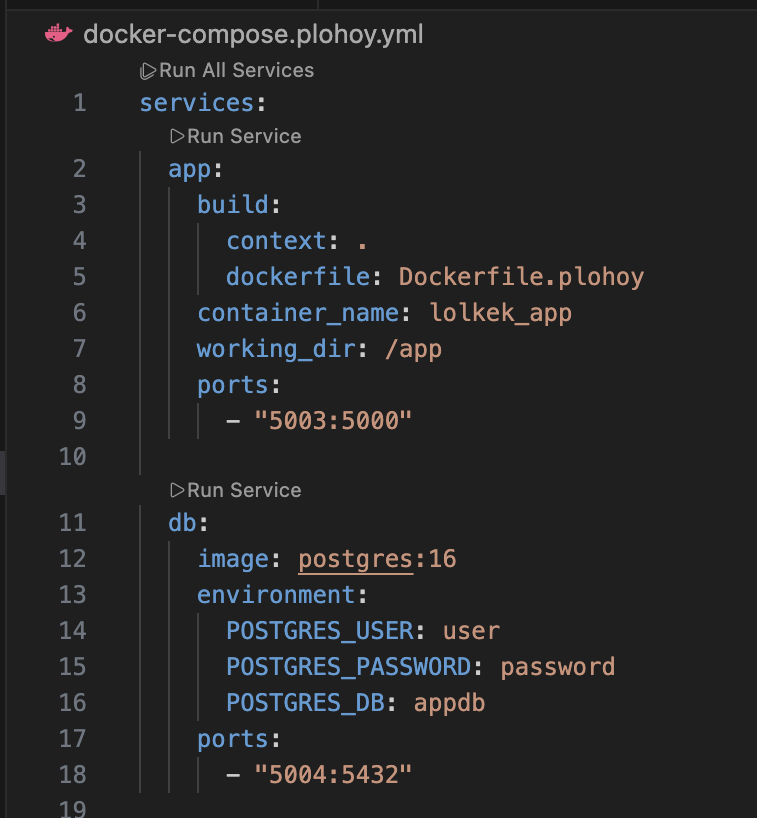
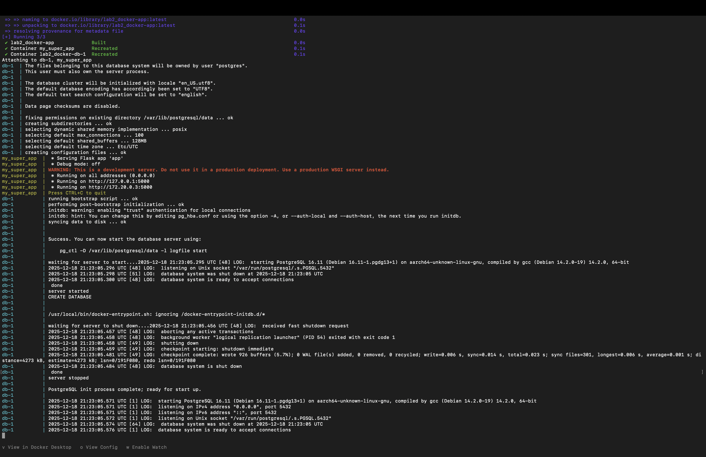
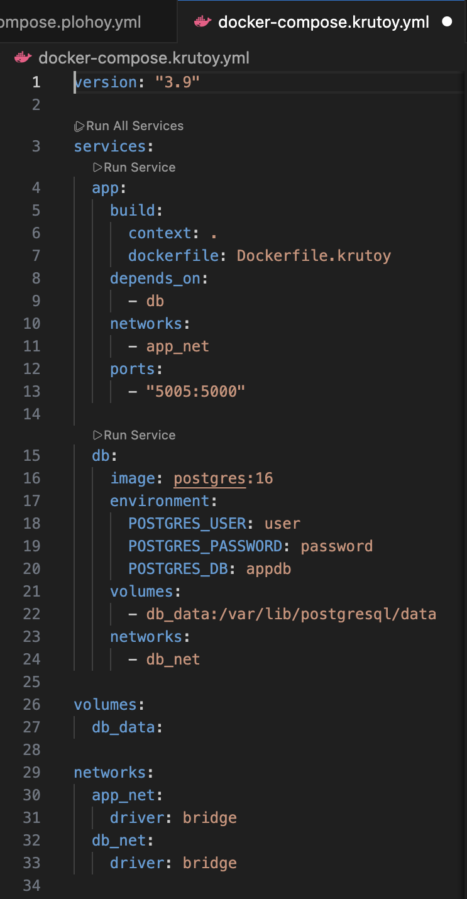
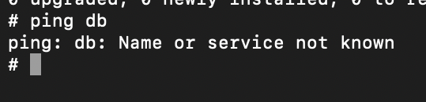

# DevOps Лабораторная №2* Новицкая Елизавета Панас Анастасия 

# 1) Перед началом выполнения, мы создали необходимые директории и файлы, аналогично связанные со второй лабораторной работой. 

Эти работы между собой очень похожи, однако есть существенные отличия.

Dockerfile описывает из чего и как собрать один докер-образ, какой взять базовый, куда положить код, какие библиотеки установить и как всё настроить.
Docker Compose - это уже про запуск всего приложения целиком. С его помощью в одном файле описывают, какие контейнеры нужны и как они работают вместе, например сервер и база данных, чтобы их можно было поднять одной командой.

# 2) Далее мы приступили к созданию "плохого" dockercompose. 

**Недостатки применения такого файла:**
1. явное указание container_name (lolkek_app), что ломает изоляцию compose-проектов
2. публикация порта базы данных наружу, любой процесс на хосте может подключиться к БД напрямую.
3. отсутствие сетевой сегментации.
 

# 3) Запуск.

В терминале ввели следующее:

docker compose -f docker-compose.plohoy.yml up --build

И получили соответствующий результат:

# 4) Затем мы создали "хороший" dockercompose.

**Преимущества такого файла:**

1. удалён container_name, Docker Compose сам генерирует имена контейнеров.
2. база данных не публикует порт наружу
3. изоляция сетей!!!

Этот контейнер работает точно, как и предыдущий, и выводит тот же текст на сайт, но подобные плохие практики
 важно исправлять.

# 5) Доказываем, что теперь изоляция есть

docker exec -it <container_id> sh
ping db

таким образом, даже в рамках одного compose-файла можно поднимать сервисы вместе, но лучше полностью изолировать их сетевое взаимодействие.

**В ходе лабораторной работы был реализован “плохой” и “хороший” Docker Compose файл с исправленными практиками, настроена сетевая изоляция контейнеров, продемонстрировано, как Docker Compose управляет сетевым взаимодействием сервисов.**
