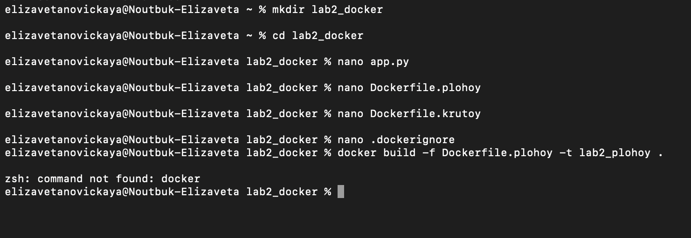
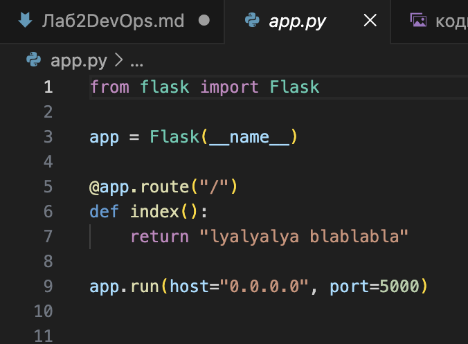
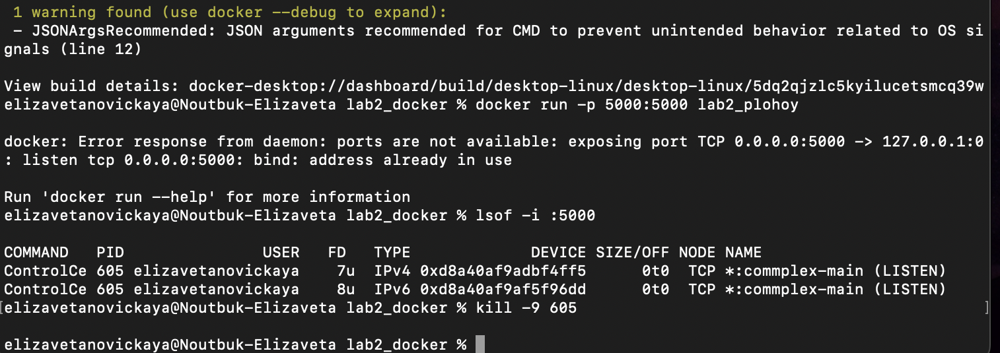
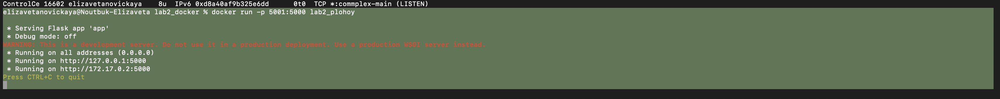
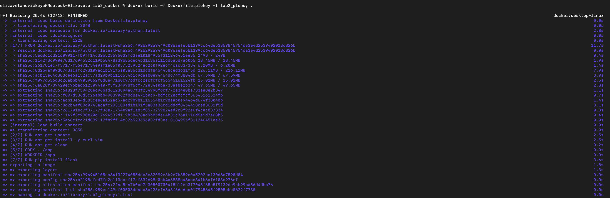
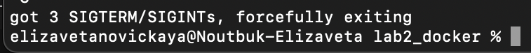
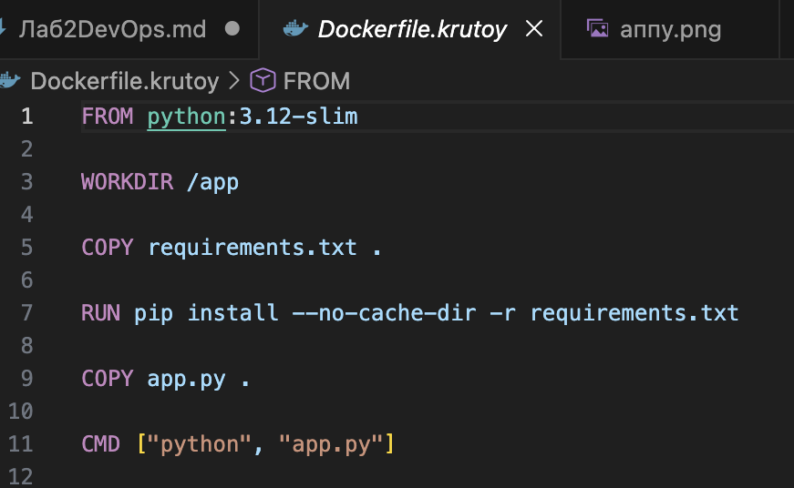

# DevOps Лабораторная №2 Новицкая Елизавета Панас Анастасия 

# 1) Перед началом выполнения, мы создали необходимые директории и файлы, а также элементарный app.py, аналогично с прошлой лабораторной работой. 

# 2) Далее мы приступили к созданию "плохого" докерфайла, сборки его образа и запуску докера. 

**Недостатки применения такого файла:**
1. latest версия python нестабильная, это может сломать всю нашу сборку.
2. команды run отдельные, что загромождает структуру и "наслаивает".
3. лишние пакеты, которые не влияют существенно, образ становится больше и неудобнее. 
4. СOPY . /app копирует всё подряд, что опять же увеличивает образ.
5. установка зависимостей напрямую (речь про pip install flask), это плохо т. к. при следующей сборке может установиться другая версия. 

**Однако он все еще работает.**

# 3) Мы запустили docker, избавились от лишних процессов и получили контейнер. 

# 4) Проверили его работу и отрубили.

# 5) Затем мы создали "хороший" докерфайл, для которого понадобился requirements.txt

**Преимущества такого файла относительно Dockerfile.plohoy:**

1. используется фиксированная версия Python
2. минимальный базовый образ
3. четко задан рабочий каталог
4. копирование только зависимостей, а не весь app.py

Исправляет все плохие практики из нашего "плохого" файла

# 6) Собрали образ и проверили работу

# 7) Потенциально плохие практики

Не ограничивать контейнер по ресурсам. Даже если Dockerfile написан корректно, контейнер не ограничен по памяти, то он может съесть всю оперативную память хоста. Мы указываем это в memory в докер-компоуз или при запуске контейнера задаем лимиты.

Давать контейнеру доступ ко всему хосту. Конечно, в наших примерах самое простое приложение и использование контейнеров, но они способны удалить файлы системы, прочитать документы и если в приложении баг - пострадает весь компьютер, в связи с чем нужно давать контейнерам ровно столько доступа, сколько необходимо. 

**В ходе работы были рассмотрены практики написания Dockerfile. Через Dockerfile.plohoy и Dockerfile.krutoy, мы продемонстрировали ошибки и их исправления при написании таких файлов. Этим мы будем в дальнейшем пользоваться на практике.**