# Case 7 - n8n & Ollama
## Выполнили: Новицкая Елизавета и Панас Анастасия, K3262
## **Цель:**
> Дайте команде инженеров машинного обучения возможность не зависеть от внешних веб-сервисов, а также модифицировать, устанавливать и работать со своими локальными моделями.

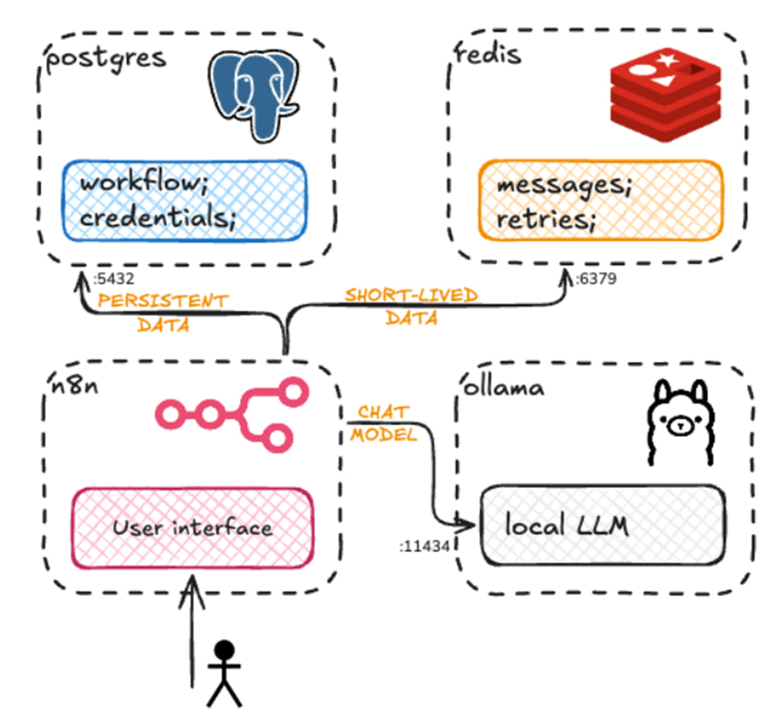

## **Реализация:**
- Ранее для других дисциплин мы уже настраивали виртуальную машину с ОС Ubuntu, с которой мы продолжим работу в ходе выполнения данного кейса, поэтому для начала обновили доступные пакеты и установили все возможные обновления:

```
sudo apt update && sudo apt upgrade -y
```
- Установили Docker и Docker Compose
> Docker Compose — это инструмент для определения и запуска многоконтейнерных приложений.
```
sudo apt install -y ca-certificates curl gnupg

sudo install -m 0755 -d /etc/apt/keyrings
curl -fsSL https://download.docker.com/linux/ubuntu/gpg | sudo gpg --dearmor -o /etc/apt/keyrings/docker.gpg
sudo chmod a+r /etc/apt/keyrings/docker.gpg

echo \
  "deb [arch=$(dpkg --print-architecture) signed-by=/etc/apt/keyrings/docker.gpg] https://download.docker.com/linux/ubuntu \
  $(. /etc/os-release && echo "$VERSION_CODENAME") stable" | \
  sudo tee /etc/apt/sources.list.d/docker.list > /dev/null

sudo apt update
sudo apt install -y docker-ce docker-ce-cli containerd.io docker-buildx-plugin docker-compose-plugin
```

<details><summary><b>пояснение флагов из кода выше</b></summary>

   ```
   sudo apt install -y ca-certificates curl gnupg
   ```
   - _ca-certificates_ - SSL-сертификаты для безопасных соединений
   - _curl_ - утилита для установки пакетов из интернета 
   - _gnupg_ - для работы с GPG-ключами
   ------
   **Добавление GPG-ключа**
   ```
   sudo install -m 0755 -d /etc/apt/keyrings
curl -fsSL https://download.docker.com/linux/ubuntu/gpg | sudo gpg --dearmor -o /etc/apt/keyrings/docker.gpg
sudo chmod a+r /etc/apt/keyrings/docker.gpg
```
> GPG-ключ Docker — это файл, который используется пакетным менеджером apt для проверки подлинности пакетов из официального репозитория Docker.
-----
**Добавление репозитория Docker**
```
echo \
  "deb [arch=$(dpkg --print-architecture) signed-by=/etc/apt/keyrings/docker.gpg] https://download.docker.com/linux/ubuntu \
  $(. /etc/os-release && echo "$VERSION_CODENAME") stable" | \
  sudo tee /etc/apt/sources.list.d/docker.list > /dev/null
  ```
> Репозиторий Docker нужен при установке, чтобы обеспечить доступность образов для запуска контейнеров.
----
**Установка списка пакетов**
```
sudo apt update
sudo apt install -y docker-ce docker-ce-cli containerd.io docker-buildx-plugin docker-compose-plugin
```
Устанавливаются Docker Community Edition, инструмент для сборки образов, Docker Compose и тп

</details><br>


- Проверили, что все установлено и вывели версии Docker'ов

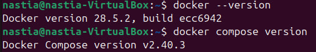

- Для того чтобы в последствии Docker можно было использовать без _sudo_ выполнили:
``` sudo usermod -aG docker $USER ```
- Создали директорию для проекта:
``` mkdir ~/case7```

- Создали файл _.env_ с настройками для n8n (пароли, юзеры и тп), а также выдали права, чтобы только владельцу можно было вносить изменения и считывать данные

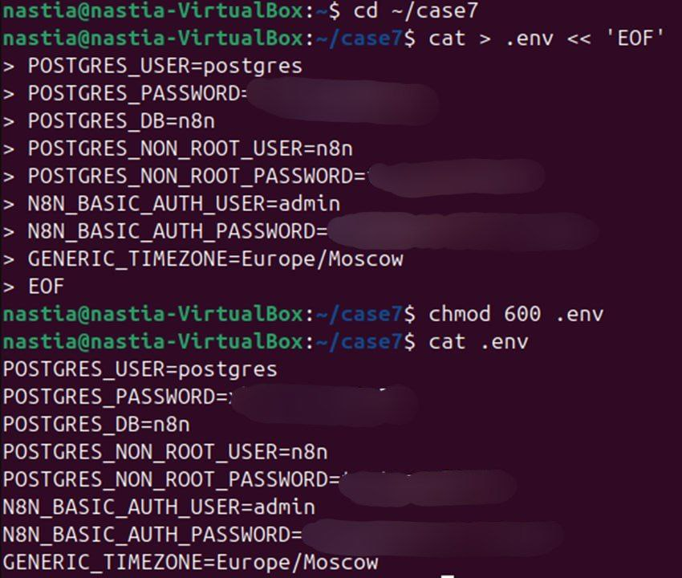

- Написали файл _user-init.sh_ для создания новых пользователей, тк, если бы n8n использовал суперпользователя по умолчанию, то это привело бы к критической ошибке и автоматически некорректной работе сервиса (если вообще работа была бы)

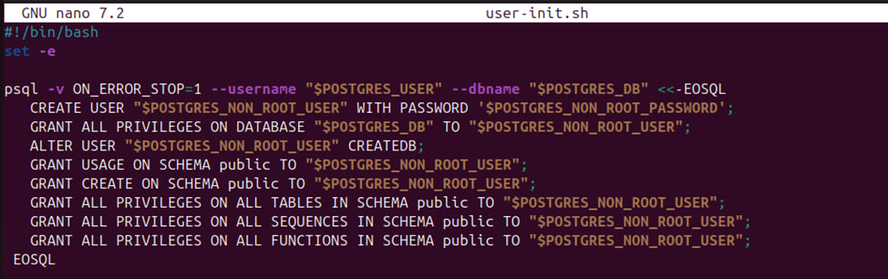

<details><summary><b>что написано на скриншоте выше?</b></summary>

``` set -e``` - весь скрипт перестанет выполняться при ошибке

```psql -v ON_ERROR_STOP=1 --username "$POSTGRES_USER" --dbname "$POSTGRES_DB" <<-EOSQL``` - выполняется подключение к бд, что так же останавливается выполнение при ошибке

``` CREATE USER "$POSTGRES_NON_ROOT_USER" WITH PASSWORD '$POSTGRES_NON_ROOT_PASSWORD';``` - создается новый пользователь, которому в последствии выдаются права на пользование бд, создание новых объектов и использование функций в схеме _public_
</details><br>

- Написали docker-compose:
```
version: '3.8'

volumes:
  db_storage:
  redis_storage:
  ollama_models:
  n8n_storage:

services:
  postgres:
    image: postgres:16
    restart: always
    environment:
      - POSTGRES_USER
      - POSTGRES_PASSWORD
      - POSTGRES_DB
      - POSTGRES_NON_ROOT_USER
      - POSTGRES_NON_ROOT_PASSWORD
    volumes:
      - db_storage:/var/lib/postgresql/data
      - ./user-init.sh:/docker-entrypoint-initdb.d/user-init.sh
    healthcheck:
      test: ['CMD-SHELL', 'pg_isready -h localhost -U ${POSTGRES_USER} -d ${POSTGRES_DB}']
      interval: 5s
      timeout: 5s
      retries: 10

  redis:
    image: redis:7
    restart: always
    command: redis-server --save 20 1 --loglevel warning
    volumes:
      - redis_storage:/data
    healthcheck:
      test: ['CMD', 'redis-cli', 'ping']
      interval: 5s
      timeout: 3s
      retries: 5

  ollama:
    image: ollama/ollama:latest
    restart: always
    ports:
      - 11434:11434
    volumes:
      - ollama_models:/root/.ollama
    healthcheck:
      test: ['CMD', 'curl', '-f', 'http://localhost:11434']
      interval: 10s
      timeout: 5s
      retries: 5

  n8n:
    image: docker.n8n.io/n8nio/n8n
    restart: always
    environment:
      - DB_TYPE=postgresdb
      - DB_POSTGRESDB_HOST=postgres
      - DB_POSTGRESDB_PORT=5432
      - DB_POSTGRESDB_DATABASE=${POSTGRES_DB}
      - DB_POSTGRESDB_USER=${POSTGRES_NON_ROOT_USER}
      - DB_POSTGRESDB_PASSWORD=${POSTGRES_NON_ROOT_PASSWORD}
      - N8N_REDIS_HOST=redis
      - N8N_REDIS_PORT=6379
      - N8N_BASIC_AUTH_ACTIVE=true
      - N8N_BASIC_AUTH_USER=${N8N_BASIC_AUTH_USER}
      - N8N_BASIC_AUTH_PASSWORD=${N8N_BASIC_AUTH_PASSWORD}
      - TZ=${GENERIC_TIMEZONE}
      - GENERIC_TIMEZONE=${GENERIC_TIMEZONE}
    ports:
      - 5678:5678
    volumes:
      - n8n_storage:/home/node/.n8n
    depends_on:
      postgres:
        condition: service_healthy
      redis:
        condition: service_healthy
      ollama:
        condition: service_started
```
```volumes``` - отвечают за сохранение данных \
```services``` - описание настроек и работы каждого из сервисов, необходимого для проекта\
```healthcheck``` - настройка состояния контроля\
```depends_on``` - зависимости сервисов (n8n не запускается до готовности redis и postgres)

- Далее запустили наш файл в фоновом режим (-d detach):
```Docker compose up -d```

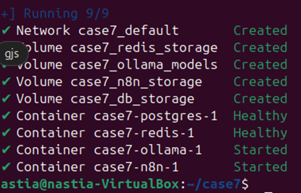

- Загрузили LLM при помощи API Ollama (выбрали phi3, тк она весит +-4Гб, а места на ВМ не так много было, а функционал достаточно обширный): 

```curl -X POST http://localhost:11434/api/pull -d '{"name": "phi3"}'```

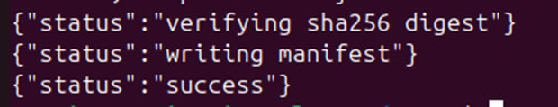

(Там все очень долго скачивалось, но в конце появилась надпись success)

- Проверили на всякий случай статус загрузки и доступные модели

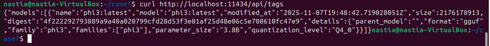

- Настроили NAT и уже с нашего устройства зашли на страницу настроенного нами n8n

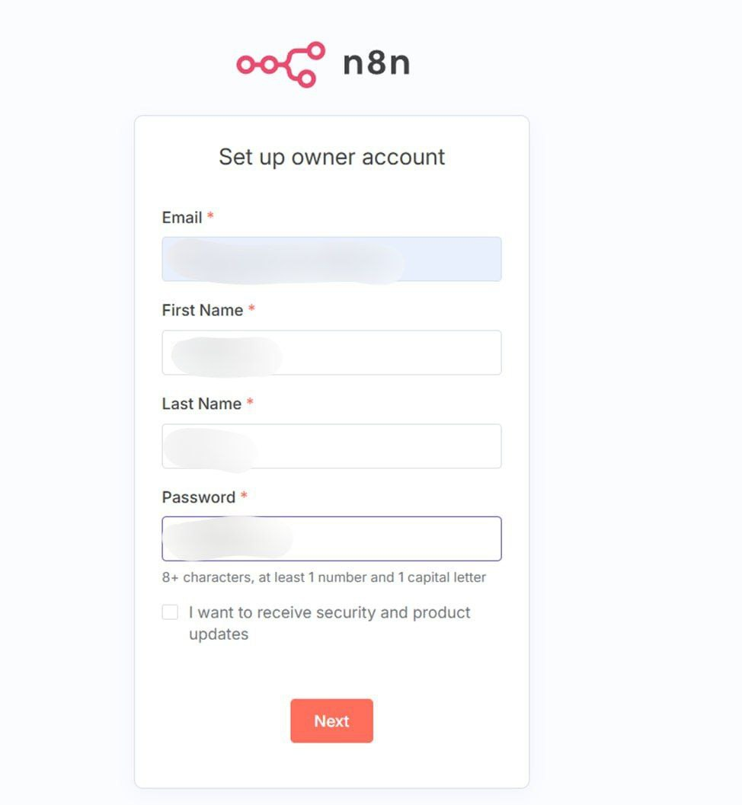

- Вошли в профиль и добавили _connection_ - нашу модель phi3


- Настроили наш _workflow_ добавили "блок" чата - цепь LLM - куда добавили нашу модель phi3 

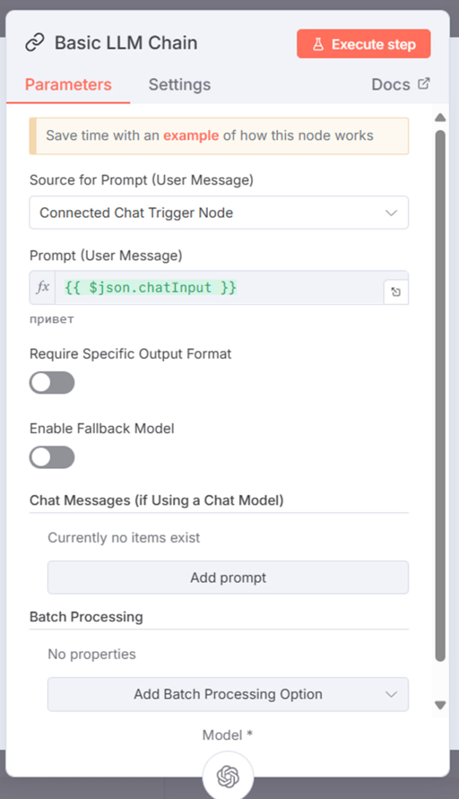

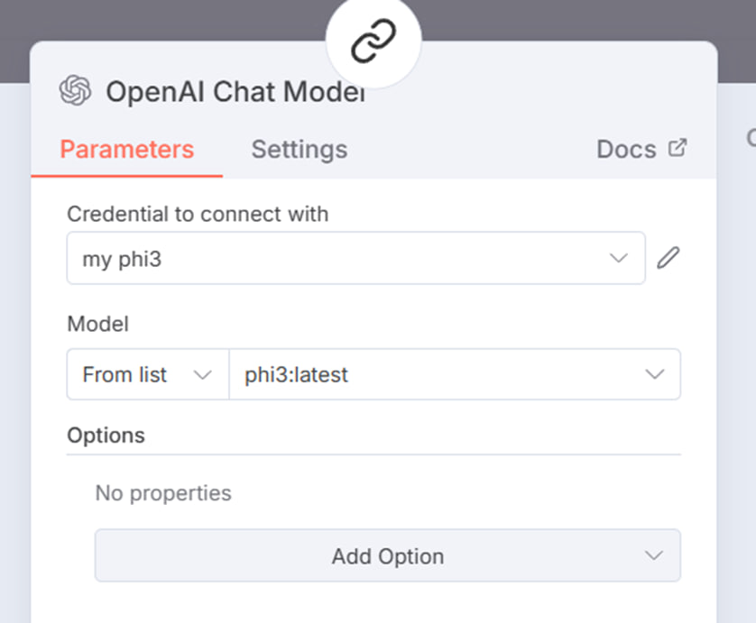

- Написали запрос, модели и получили соответствующий ответ

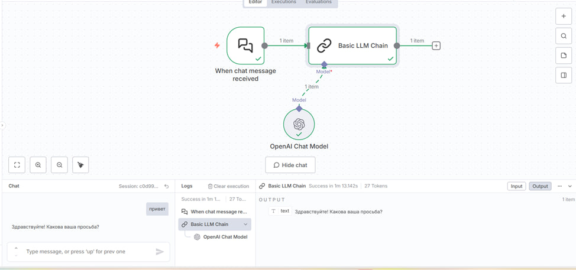

## **Выводы:**

Как итог, мы настроили сервис, который требовался от нас по ТЗ, получили workflow, который соответствует примеру из задания, протестировали и получили корректную в работе модель.


## **Источники:**
1. [Установка Docker'а на Ubuntu](https://docs.docker.com/engine/install/ubuntu/)
2. [Отсюда почерпнулии структуру правильного написания Docker Compose](https://github.com/n8n-io/n8n-hosting/tree/main/docker-compose/withPostgres)
3. [Документация по n8n & Docker](https://docs.n8n.io/hosting/installation/docker/#using-with-postgresql)
4. [Документация по Docker & PostgreSQL, переменные окружения](https://hub.docker.com/_/postgres)
5. [Список доступных LLM-моделей в Ollama](https://ollama.com/library)
6. [Чтобы вспомнить теорию по Docker'ам](https://selectel.ru/blog/tutorials/how-to-create-docker-repository/?ysclid=mht0v68ec1467980060)
7. [Еще теории](https://docs.docker.com/compose/)
8. [И еще](https://dockerhosting.ru/blog/svoj-docker-registry/#SSL_%E2%80%94_%D1%81%D0%B5%D1%80%D1%82%D0%B8%D1%84%D0%B8%D0%BA%D0%B0%D1%82%D1%8B_%D0%B8_Nginx)