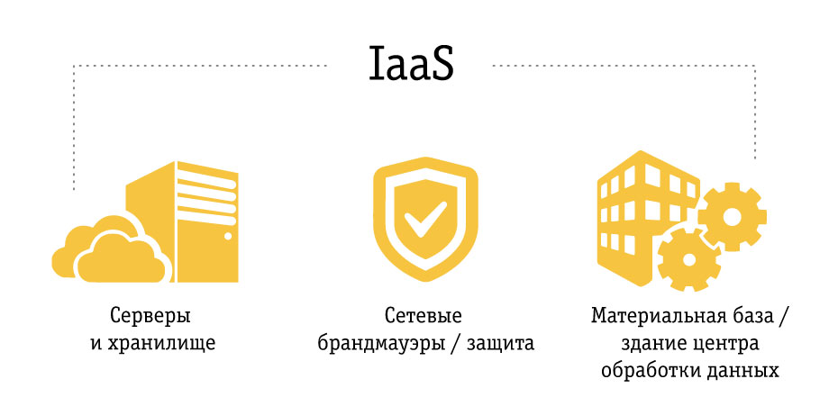
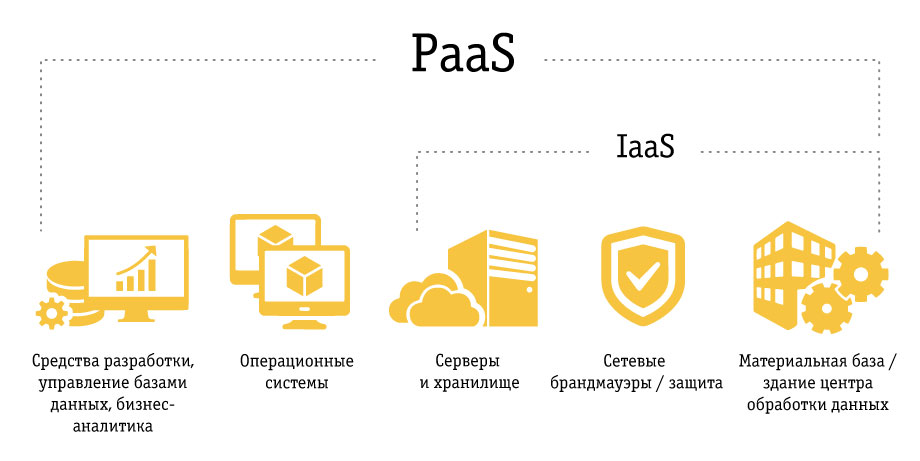
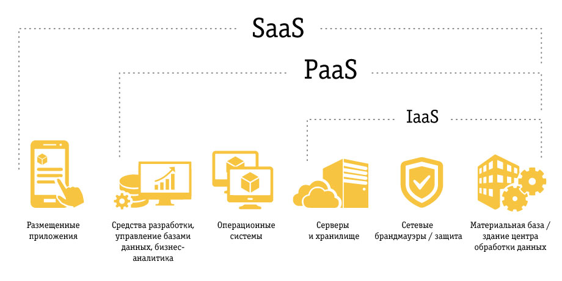
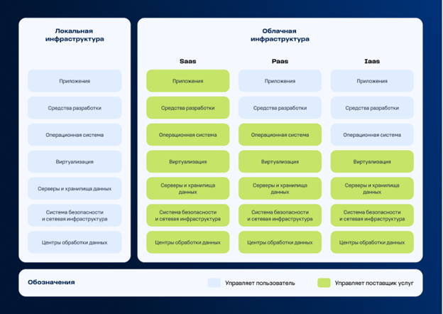
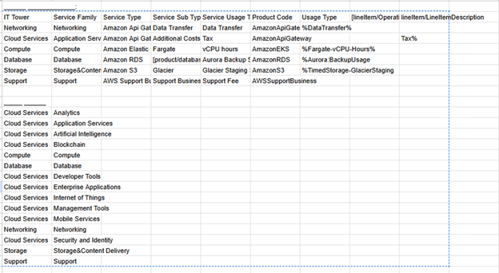
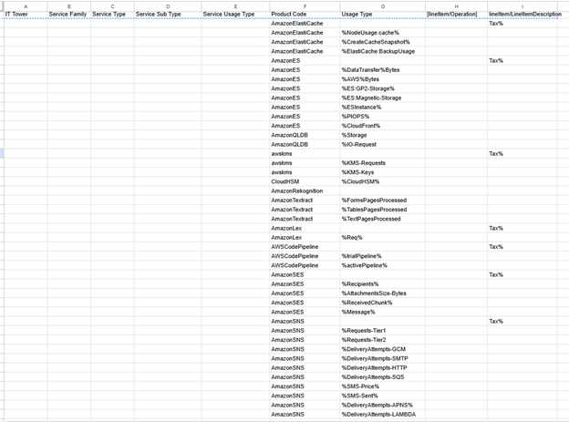
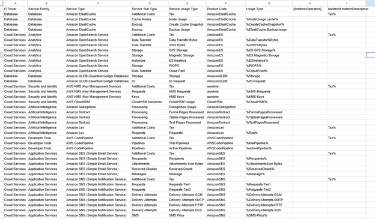

# Облачная лабораторная 1
## Выполнили: Новицкая Елизавета и Панас Анастасия К3262

- [Облачная лабораторная 1](#облачная-лабораторная-1)
  - [Цель](#цель)
  - [Постановка задач](#постановка-задач)
  - [Теория](#теория)
  - [Реализация](#реализация)
  - [Итоги](#итоги)

  ## **Цель:**
  Знакомство с облачными сервисами. Понимание уровней абстракции над инфраструктурой в облаке. Формирование понимания типов потребления сервисов в сервисной-модели. 

  ## **Постановка задач:**

  ### Дано:

  1.	Слепок данных биллинга от провайдера после небольшой обработки в виде SQL-параметров. Символ % в начале/конце означает, что перед/после него может стоять любой набор символов.
  
  2.	Образец итогового соответствия, что желательно получить в конце. В этом же документе  

  ### Необходимо:

  1.	Импортировать файл .csv в Excel или любую другую программу работы с таблицами. Для Excel делается на вкладке Данные – Из текстового / csv файла – выбрать файл, разделитель – точка с запятой.
  
  2.	Распределить потребление сервисов по иерархии, чтобы можно было провести анализ от большего к меньшему (напр. От всех вычислительных ресурсов Compute дойти до конкретного типа использования - Выделенной стойка в датацентре Dedicated host usage).
  
  3.	Сохранить файл и залить в соответствующую папку на Google Drive.

  ## **Теория:**

  Для начала мы изучили теорию вопроса, сейчас попытаемся объяснить на пальцах со схемами, которые мы нашли

  > IaaS (Infrastructure as a Service) — это инфраструктура, базовый набор, на основе которого вы можете приготовить что угодно, поставщик предоставляет в аренду виртуальные серверы, системы хранения данных и сетевое оборудование. Пользователь, в свою очередь, самостоятельно управляет операционными системами, приложениями и данными
  
  
  
  
  > PaaS (Platform as a Service) - это платформа, которая поможет решить одну конкретную задачу и предоставит инструменты для этого, поставщик предлагает готовую среду для разработки, тестирования и внедрения приложений, позволяя пользователю сконцентрироваться исключительно на создании ПО
  
  

  > SaaS (Software as a Service) - это ПО/программа, которая или целиком располагается в интернете, или хранит там только ваши файлы, поставщик предоставляет готовое приложение, доступное через Интернет, избавляя пользователя от необходимости установки, поддержки и обновления этого ПО

   

   И еще вот такая схема для наглядности:

    

    <details><summary><b>источники</b></summary>
      
    1. [Киберпротект - Что такое IaaS, PaaS, SaaS и каковы различия между ними](https://cyberprotect.ru/blog/cloud-services-models)

    2. [Билайн - Корпоративный IaaS, PaaS, SaaS. Что это такое и зачем нужны?](https://b2blog.beeline.ru/korporativnyi-iaas-paas-saas/)
    </details><br>

## **Реализация:**

**Прежде всего надо было определиться с вариантом**

Наши ИСУ: 467006 и 466909

4+6+7+0+0+6+4+6+6+7+9+0+9=57

5+7=12

1+2=3

**Взяли вариант 3** 

### Алгоритм работы:

Сопоставить входящие данные от провайдера с его же документацией. Написать в соответствие колонкам справа значения 5 колонок слева, которые бы однозначно классифицировали тип сервиса. Для столбцов IT Tower и Service Family значения можно выбрать из образца.

### Обзор исходных данных

У нас была таблица-пример



И таблица, которую предстояло заполнить



```IT-Tower``` - самый высокий уровень классификации, стратегическая категория

```Service Family``` - семейство внутри "башни"

```Service Type``` - читаемое название сервиса

```Service Sub Type``` - уточнение типа (его вариация)

```Service Usage``` - конкретный вид потребления в читаемом виде

```Product Code``` - уникальный код AWS сервиса

```Usage Type``` - как использовался (тип потребления, метрика биллинга)

```LineItem/Operation``` - API/тип операции, которая привела к затратам

```LineItem/LineItemDescription``` - текстовое описание позиции счета

### Алгоритм заполнения

[Документация AWS](https://docs.aws.amazon.com/)

1. В документации по _Product Code_ ищем название сервиса (_Service Type_)

2. Там же можно найти, к какому семейству _Service Family_ он относится

3. Из таблицы примера заполняем _IT-Tower_ по имеющемуся _Service Family_ 

4. По трем последним столбцам и документации определяем, что именно потреблялось и заполняем _Service Usage_

[Получили таблицу с распределением сервисов по иерархии](https://docs.google.com/spreadsheets/d/1OhrTKzTkDJ8p3CTCl8kWpgKeBID37lhszYuJUWj4QlM/edit?usp=sharing)



## **Итоги:**
Познакомились с облачными сервисами, изучили теорию по IAAS, PAAS, SAAS, распределили потребление сервисов AWS по иерархии.


