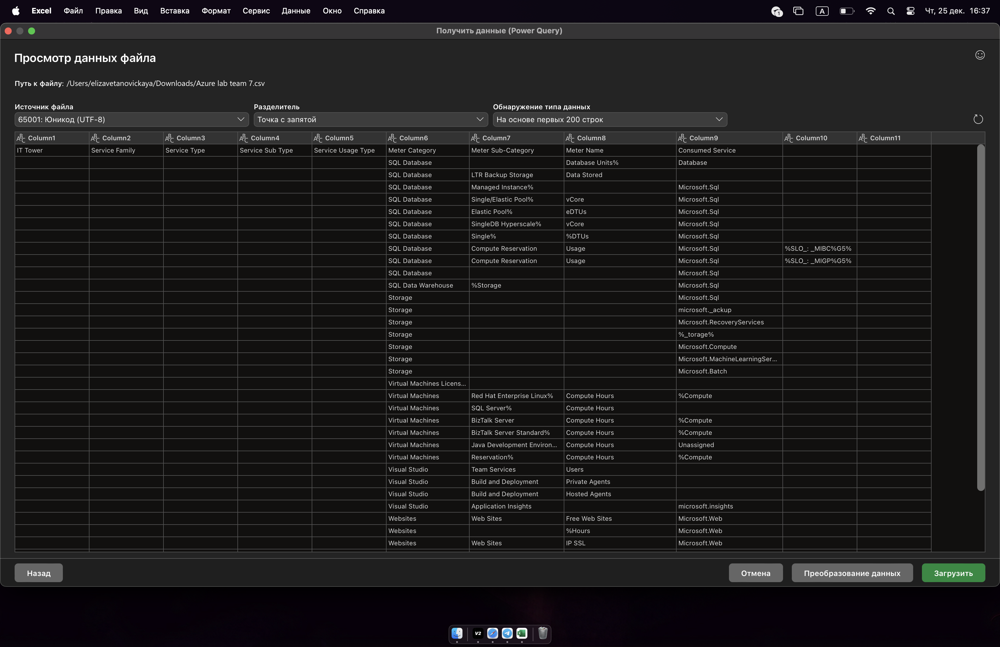
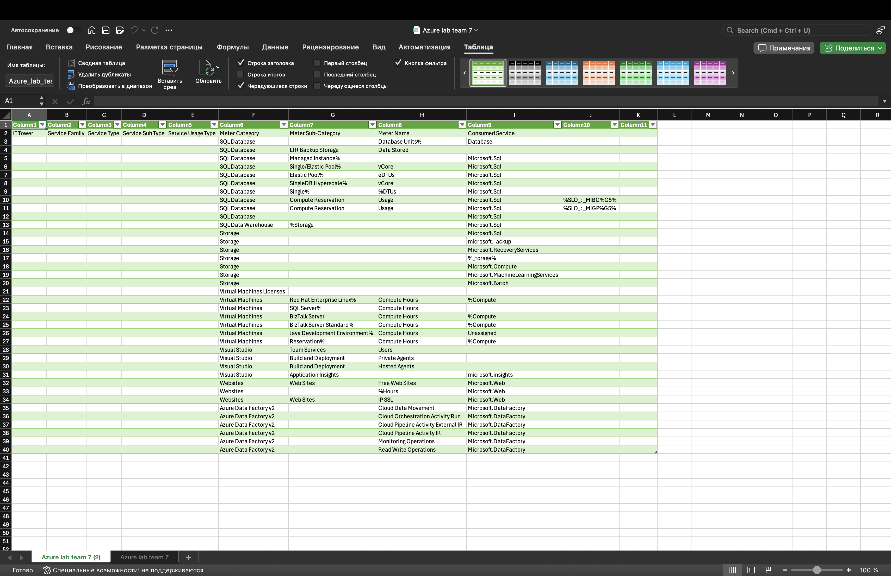
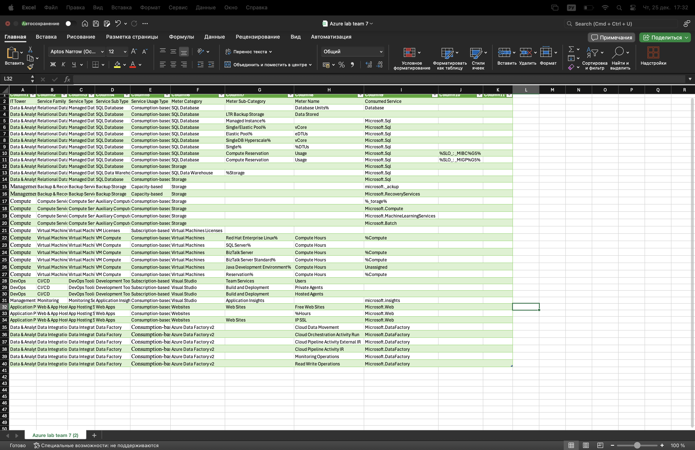

# Новицкая Елизавета Панас Анастасия 
# Облачная Лабораторная работа №2
  Сравнение сервисов Amazon Web Services и Microsoft Azure. Создание единой кросс-провайдерной сервисной модели.

**Цель работы: Получение навыков аналитики и понимания спектра публичных облачных сервисов без привязки к вендору. Формирование комплексного видения Облака.**

**Мы взяли файл team 7 для этой работы, так как мы 7я команда в списке**

*В лабораторной работе 1 мы использовали слепок team 3. Надеемся это не критично :D*

*Логику классификации сервисов мы в любом случае постарались показать. Применение единой модели к любым данным Azure было задачей нашей работы.*

1) Основываясь на разработанной структуре в первой лабораторной, мы использовали иерархическую модель классификации:
IT Tower, Service Family, Service Type, Service Sub Type, Service Usage Type

2) Что нам было дано:
CSV файл с данными Azure.
Mapping rules AWS (пример, как классифицируются сервисы AWS)

3) Импорт данных в Excel

Для начала мы открыли предоставленный файл в Excel и нажали получить данные с разделителем: 

4) Основной ход работы

После загрузки мы посмотрели на колонки в файле, основная информация о сервисе находится в названиях Meter Name и Consumed Service.

Дальше мы начали разбирать данные построчно. Для каждой строки мы смотрели на название сервиса и думали, что это за сервис по смыслу. Например, если в строке был SQL Database, мы понимали, что это база данных. Значит, такой сервис относится к аналитике и работе с данными. Если это Virtual Machines, то это вычислительные ресурсы. Если это Web Sites, значит это для размещения приложений.

После этого мы начинали заполнять классификацию сверху вниз. Сначала выбирали IT Tower, затем выбирали Service Family, потом указывали Service Type, то есть тип сервиса, например Managed Database или Virtual Machine. В конце мы указывали Service Usage Type, то есть как этот сервис считается.

Получился единый способ классификации, чтобы можно было анализировать использование облачных сервисов независимо от провайдера. 

Вот такой вот результат. 

Итог работы: Мы взяли данные Azure и разложили их по той же схеме, что и AWS, чтобы оба облака можно было сравнивать по одной модели. 

