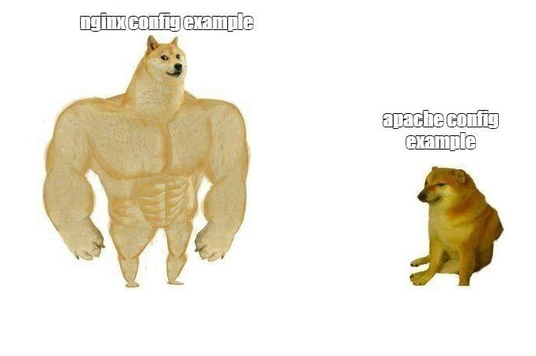
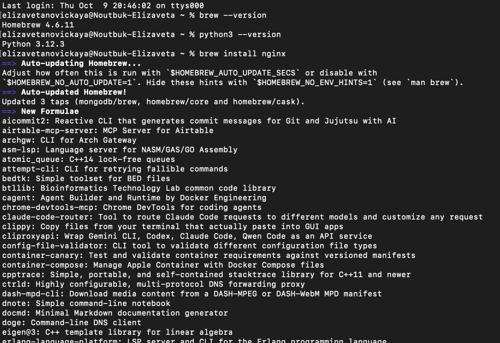
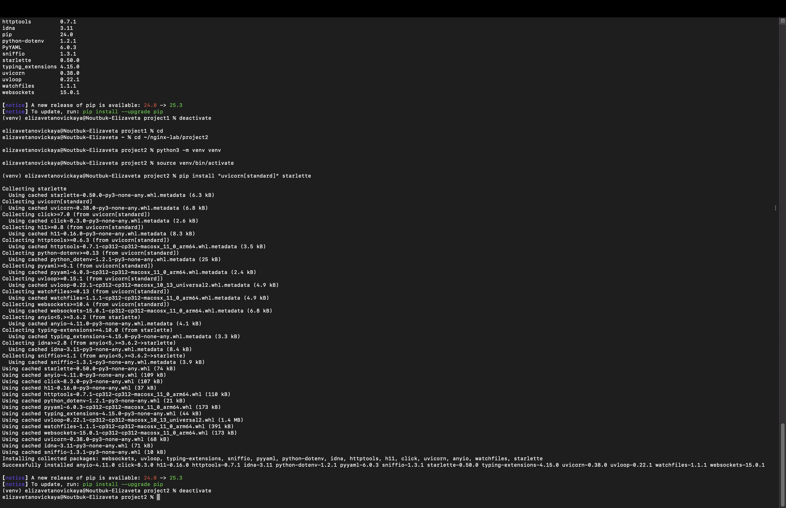
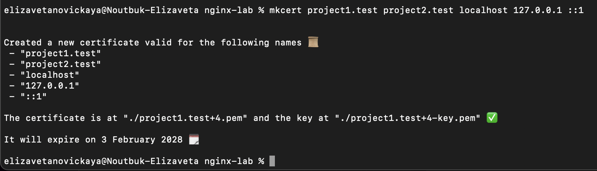
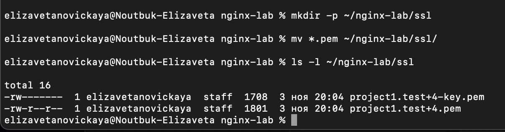
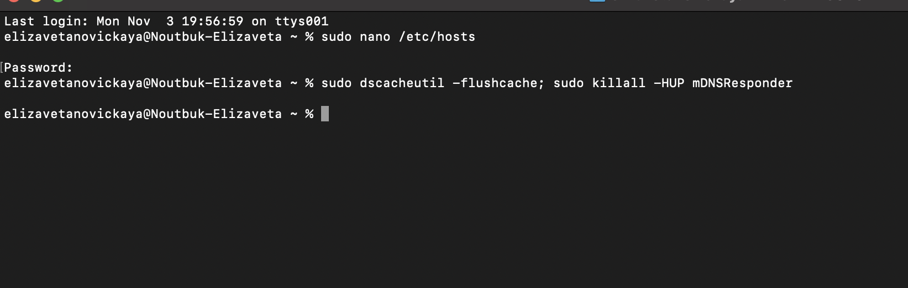
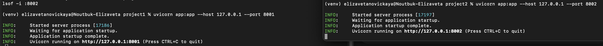
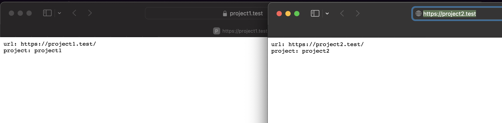

# Лабораторная работа DevOps №1
# Новицкая Елизавета, Панас Анастасия К3262

Работа выполнена на MacOS

1) Подготовка к выполнению

Сначала были установлены необходимые пакеты.
Затем созданы папки под проекты следующим образом:

2) Nginx

nginx сам по себе не создает страницы, он только перенаправляет запросы и в каждый из проектов мы взяли минимальное приложение на starlette (по ссылке из задания) чтобы было проще.

Мы настроили окружения:

Затем мы создали сертификат с помощью mkcert

Сертификат SSl

Далее был создан файл projects.conf со следующим содержимым:

Мы столкнулись с проблемами при подключении, но в /etc/hosts добавили данные строки, и все заработало - 

127.0.0.1 project1.test 127.0.0.1 project2.test

3) Проверка портов

4) Проверка сайтов

5) Проверка alias

Мы создали каталог static и через терминал прописывали всевозможные варианты для вывода на сайт:

echo "blablabla" > ~/nginx-lab/project1/static/test.txt

В этой лабораторной работе мы настроили веб-сервер nginx, чтобы на одном сервере можно было запустить два проекта. Оба сайта работают с сертификатом. Настроили разные домены для проектов и сделали пути к статическим файлам через alias.
Для проверки два простых приложения на starlette, и они успешно открылись по своим адресам — https://project1.test и https://project2.test.
